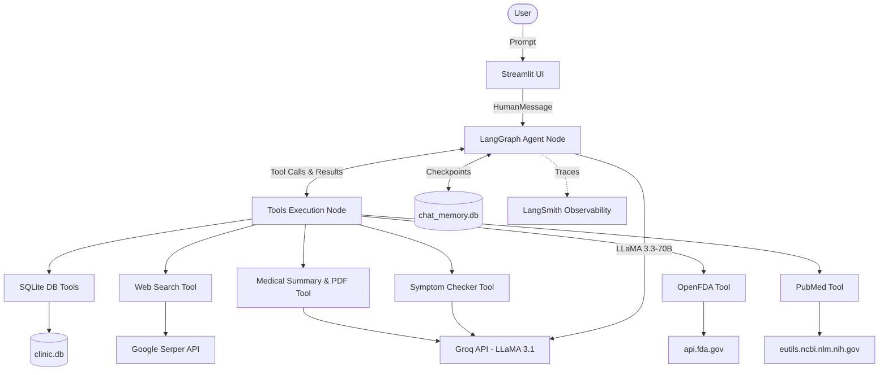

# 🏥 Al-Rafiq Al-Tibbi (Medical AI Assistant)

An advanced medical AI assistant built with LangGraph, Groq, and Streamlit. Features multi-tool ReAct reasoning, live API integrations (PubMed, OpenFDA), and automated PDF reporting within a modern glassmorphism UI.

This agent is designed to autonomously look up patient records, doctors, prescriptions, and appointments from an internal clinic database, while intelligently falling back to web searches for general medical knowledge and symptom checking.

## 🌟 Key Features

- **Agentic Reasoning (LangGraph):** Uses a robust ReAct state machine to decide when to query the database, when to search the web, and when to synthesize data.
- **Standalone Local DB:** Includes an auto-generating SQLite database (`clinic.db`) with realistic dummy data for seamless local testing.
- **External Medical APIs:** Integrates the massive **OpenFDA API** for official drug adverse reactions, and the **PubMed API** for peer-reviewed medical journals.
- **Symptom Checker Tool:** Cross-references patient symptoms via web search to determine the likely condition, and queries the local clinic database to recommend the correct specialist.
- **Medical Summary & PDF Export:** Aggregates a patient's conditions, prescriptions, and appointments into a cohesive, AI-generated clinical report, and allows users to **download it as a physical PDF**.
- **Enterprise Observability:** Fully instrumented with **LangSmith** tracing for production-grade monitoring and debugging.
- **Persistent Memory:** Uses `SqliteSaver` to maintain chat history across server restarts.
- **Modern UI:** Built with Streamlit, featuring real-time tool-execution badges and sidebar session stats.

## 🏗️ Architecture



## 🚀 Getting Started

### Prerequisites
- Python 3.12+
- API keys for [Groq](https://console.groq.com/) and [Serper](https://serper.dev/)

### Installation

1. **Clone the repository**
   ```bash
   git clone https://github.com/shahdelhadad/al-rafiq-medical-ai.git
   cd al-rafiq-medical-ai
   ```

2. **Set up the environment**
   ```bash
   python -m venv .venv
   source .venv/bin/activate  # On Windows: .venv\Scripts\activate
   pip install -r requirements.txt
   ```

3. **Configure API Keys**
   Copy the example environment file and add your keys:
   ```bash
   cp .env.example .env
   ```

4. **Initialize the Database**
   Generate the local SQLite database with seed data:
   ```bash
   python db_setup.py
   ```

5. **Run the Application**
   ```bash
   streamlit run app.py
   ```

## 🛠️ Tech Stack
- **Framework:** LangChain & LangGraph
- **LLM:** Groq (LLaMA-3.3-70b-versatile, LLaMA-3.1-8b-instant)
- **Frontend:** Streamlit
- **Database:** SQLite3
- **Search:** Google Serper API
